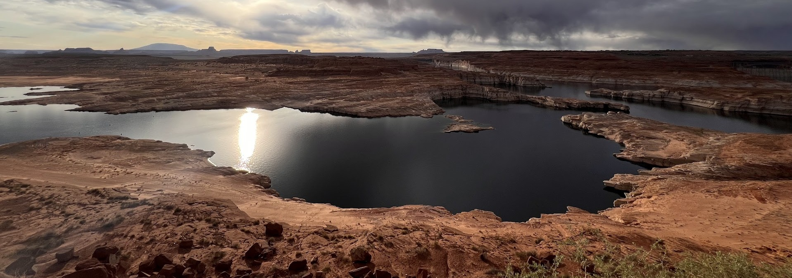

# Open Water Evapoation Network

Beta Status: This website is currently under development and may have some limitations or issues. Evaporation data should be considered provisional and not used for operational support or decision making. A production version of this API and database is scheduled to launch late summer 2025. 

## Overview

The Open Water Evaporation Network (OWEN), created by researchers from DRI, TAMU, VTech, and Reclamation, offers broad access to DLEM evaporation estimates and provides operational support to stakeholders like Reclamation, the Texas Water Development Board, and the United States Army Corps of Engineers. Within the OWEN ecosystem, partner datasets are organized as individual tables, ensuring consistent and efficient data access. OWEN employs custom scripts and software to generate stakeholder-specific data, facilitating the integration of diverse weather and reservoir information. 

## About This Project

Open-water evaporation represents a complex physical process that influences both the water and energy budgets of a lake or reservoir. Though open-water evaporation is critical for water quality, water distribution, and legal accounting, developing reliable estimates is challenging.

Historically, water management agencies such as the Bureau of Reclamation (Reclamation) have relied on evaporation estimates from Class A pans for water budget and accounting purposes. While simple and relatively inexpensive to maintain, Class A pans and the associated evaporation estimates have known biases relative to more advanced estimation techniques. This bias, which can depend on water body characteristics like depth and volume, is often attributed to a lack of heat storage in Class A pans relative to real water bodies.

## Reclamation Database

The BOR Reservoir Evaporation API provides public access to historical, and near-real-time daily evaporation estimates for 247 Bureau of Reclamation reservoirs located across the 17 western states. Reservoir evaporation estimates are generated using the Texas A&M Daily Lake Evaporation Model (DLEM) (Zhao and Gao, 2019; Zhao et al., 2024). 

This project developed a daily reservoir evaporation database which can be freely accessed and visualized by water managers and stakeholders. This database contains historical and near real-time, high quality data records of evaporation rates and volumes for major reservoirs. This API delivers high-quality data records of evaporation rates and volumes for major reservoirs. The evaporation estimates incorporate meteorological forcing data and reservoir storage information to provide the best available estimates of reservoir evaporation.

Data can be accessed interactively via the web interface at:
- [https://dri-apps.earthengine.app/view/bor-reservoir-evaporation](https://dri-apps.earthengine.app/view/bor-reservoir-evaporation)

Or programmatically through the API at:
- [https://operevap.dri.edu/docs](https://operevap.dri.edu/docs)

See the [Getting Started](https://operevap.launchpad.wiki/started/getting-started/) section for help with the API.

## Coming Soon

Additional datsets including state-wide estimates for the State of Texas, forecasting, as well as a CONUS-wide modeling effort including over 44,000 water bodies will be incorporated into the OWEN framework in 2026. 

## Collaborative Development

This dataset and API was collaboratively developed by the Reclamation, Desert Research Institute, Texas A&M University, Virginia Tech University, and NASA. 

## Disclaimer

Data and information provided through this application are part of an active research project and should be considered provisional and subject to change. A production version of this API and database is scheduled to launch late summer 2025. Users should perform thorough review prior to operational application and decision making.

## Funding and Support

This project received funding from the BOR Research and Development Office (R20AC00008) and NASA Water Resources Program (80NSSC22K0933). Additional support provided by the USGS, USACE, the Texas Water Development Board, and the Oregon Water Resources Department.

## Additional Resources

- Abatzoglou, J. T. (2013), Development of gridded surface meteorological data for ecological applications and modelling. Int. J. Climatol., 33: 121–131.
- De Pondeca, M. S. F. V., and Coauthors, 2011: The Real-Time Mesoscale Analysis at NOAA's National Centers for Environmental Prediction: Current status and development. Wea. Forecasting, 26, 593–612, https://doi.org/10.1175/WAF-D-10-05037.1.
- Tanny, J., and Coauthors, 2008: Evaporation from a small water reservoir: Direct measurements and estimates. J. Hydrology, 351, 218-229.
- Zhao, G., and H. Gao, 2019: Estimating reservoir evaporation losses for the united states: Fusing remote sensing and modeling approaches. Remote Sensing of Environment, 226, 109–124.
- Zhao, B., Huntington, J., Pearson, C., Zhao, G., Ott, T., Zhu, J., ... & Gao, H. (2024). Developing a general Daily Lake Evaporation Model and demonstrating its application in the state of Texas. Water Resources Research, 60(3), e2023WR036181.
