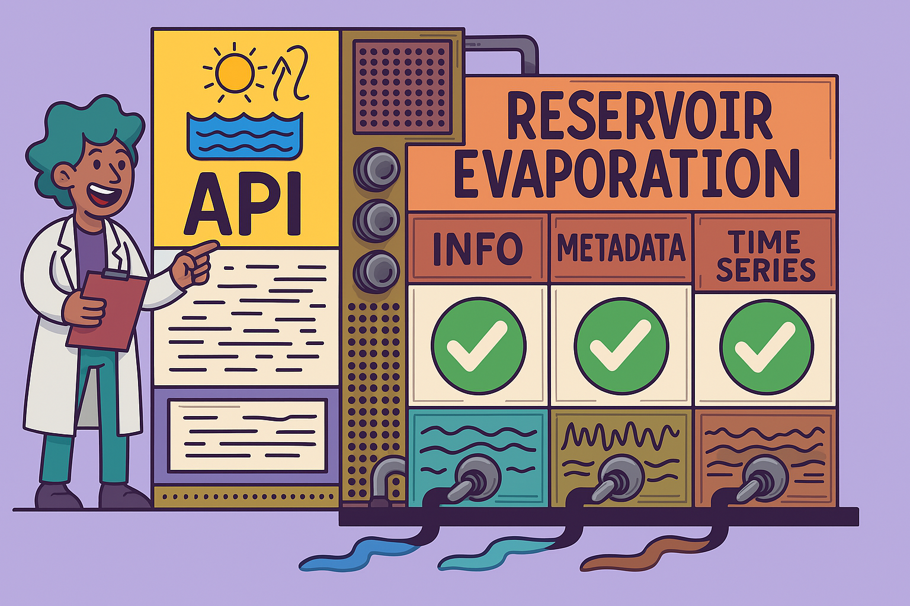

# Reservoir Evaporation API Documentation

## Overview

The Reservoir Evaporation API provides public access to historical and near-real-time daily evaporation estimates from Bureau of Reclamation reservoirs located across 17 western states.

This API delivers high-quality data records of evaporation rates and volumes for major reservoirs. The evaporation estimates incorporate meteorological forcing data and reservoir storage information to provide the best available estimates of reservoir evaporation.

## About This Project

Open-water evaporation represents a complex physical process that influences both the water and energy budgets of a lake or reservoir. Though open-water evaporation is critical for water quality, water distribution, and legal accounting, developing reliable estimates is challenging.

Historically, water management agencies such as the Bureau of Reclamation (Reclamation) have relied on evaporation estimates from Class A pans for water budget and accounting purposes. While simple and relatively inexpensive to maintain, Class A pans and the associated evaporation estimates have known biases relative to more advanced estimation techniques. This bias, which can depend on water body characteristics like depth and volume, is often attributed to a lack of heat storage in Class A pans relative to real water bodies.

This project developed a daily reservoir evaporation database which can be freely accessed and visualized by water managers and stakeholders. This database contains historical and near real-time, high quality data records of evaporation rates and volumes for major reservoirs.

## Collaborative Development

This API was collaboratively developed by the Bureau of Reclamation (BOR) and Desert Research Institute.

## Disclaimer

Data and information provided through this application are part of an active research project and should be considered provisional and subject to change. Users should perform thorough review prior to operational application and decision making.

## Additional Resources

- Abatzoglou, J. T. (2013), Development of gridded surface meteorological data for ecological applications and modelling. Int. J. Climatol., 33: 121–131.
- De Pondeca, M. S. F. V., and Coauthors, 2011: The Real-Time Mesoscale Analysis at NOAA's National Centers for Environmental Prediction: Current status and development. Wea. Forecasting, 26, 593–612, https://doi.org/10.1175/WAF-D-10-05037.1.
- Tanny, J., and Coauthors, 2008: Evaporation from a small water reservoir: Direct measurements and estimates. J. Hydrology, 351, 218-229.
- Zhao, G., and H. Gao, 2019: Estimating reservoir evaporation losses for the united states: Fusing remote sensing and modeling approaches. Remote Sensing of Environment, 226, 109–124.
- Zhao, B., and Coauthors, 2023: Developing a Daily Lake Evaporation Model and Generating a Long-term Daily Reservoir Evaporation Dataset in Texas. Submitted to Water Resources Research.
