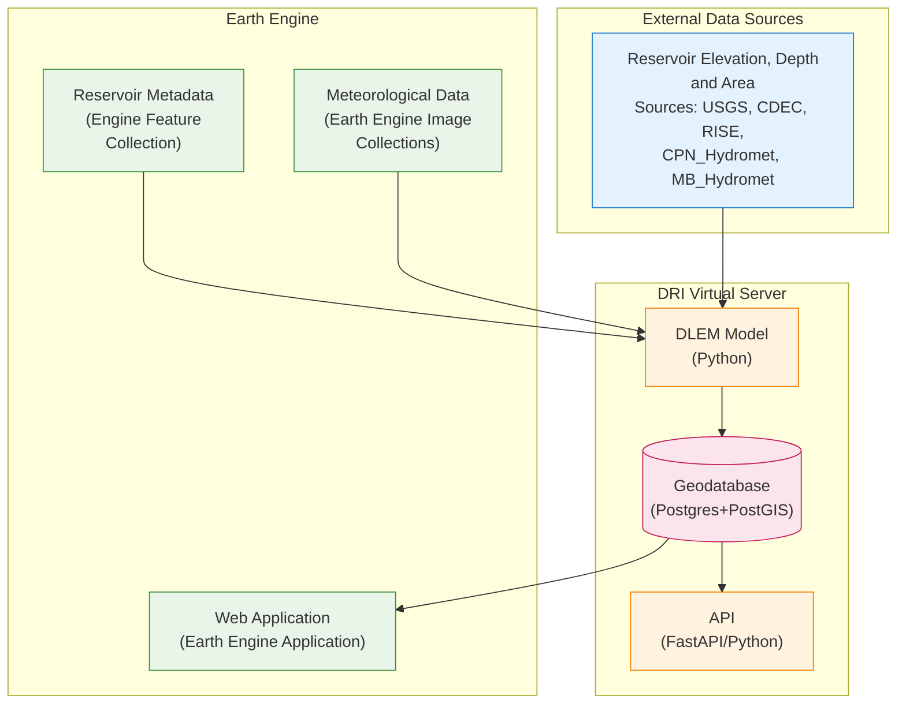

# OperEvap Tech Stack Documentation

## System Overview

The Desert Research Institute (DRI) operates a robust, production-grade system designed to accurately estimate reservoir evaporation. This sophisticated system leverages the Texas A&M Daily Lake Evaporation Model (DLEM) as the foundational model used to estimate reservoir evaporation rates.

The system integrates a comprehensive suite of processes including:

- **Data acquisition and processing**
- **Advanced modeling capabilities**
- **Secure data storage**
- **Interactive data visualization**

At the heart of the system is a powerful cloud computing infrastructure comprised of Google Cloud Platform and Google Earth Engine, providing unparalleled access to vast satellite and climate datasets with advanced data analysis capabilities. The system's core database, codebase, and API are securely hosted and maintained by DRI's IT staff on a virtual machine server.

## System Architecture



## System Components

### Data Acquisition & Processing

DRI manages the entire process of collecting and preparing hydrometeorological data, including:

- **Unit conversion** for standardized data formats
- **Precomputation** of relevant climate variables
- **Quality control procedures** to ensure data accuracy

### Modeling Engine (Python/Google Earth Engine)

The DLEM model is executed within a Python environment leveraging Google Earth Engine's cloud computing capabilities for:

- Efficient processing of large datasets
- Analysis of satellite and climate data
- Integration of historical and current data sources

### Geodatabase (PostgreSQL + PostGIS)

All system data is securely stored within a PostgreSQL database utilizing the PostGIS extension:

- **Reservoir metadata** - Geographic and descriptive information
- **Ancillary input data** - Supporting datasets for calculations
- **DLEM-derived evaporation estimates** - Time series results

### API (FastAPI/Python)

A FastAPI-based Application Programming Interface provides programmatic access to the geodatabase:

- **Base URL**: [https://operevap.dri.edu](https://operevap.dri.edu)
- **Documentation**: [https://operevap.launchpad.wiki/](https://operevap.launchpad.wiki/)
- Enables automated data retrieval and integration
- Supports targeted data queries by reservoir, variable, and time period

### Web Application (Earth Engine)

An interactive web application built using the Earth Engine JavaScript API:

- **URL**: [https://dri-apps.earthengine.app/view/bor-reservoir-evaporation](https://dri-apps.earthengine.app/view/bor-reservoir-evaporation)
- Facilitates visualization and exploration of reservoir evaporation data
- Interactive mapping and data analysis capabilities

## Technical Details

### Infrastructure

The system is hosted by DRI on a virtual machine server running **Rocky Linux 9.5 (Blue Onyx)**:

```yaml
Operating System: Rocky Linux 9.5
Platform: el9 (RHEL-compatible)
Support End: 2032-05-31
Vendor: Rocky Enterprise Software Foundation (RESF)
```

### Modeling Engine Implementation

DRI employs Python-based scripts leveraging the Earth Engine Python API that:

- Seamlessly integrate historical and current climate raster data from Earth Engine
- Combine Earth Engine data with reservoir-related data from external sources
- Utilize Earth Engine's robust processing capabilities
- Calculate area-averaged daily DLEM evaporation estimates for each reservoir

### Data Storage Schema

Time series data generated by the modeling engine is ingested into the PostgreSQL geodatabase:

- **Timeseries Table**: Each variable, reservoir, and time step as distinct entries
- **Feature Table**: Reservoir geometries and spatial information
- **Feature Metadata Table**: Associated descriptive metadata
- **PostGIS Extension**: Efficient spatial data management and queries

All tables are accessible via API endpoint requests, enabling targeted and efficient data retrieval.

### Data Access Methods

#### Programmatic Access
The FastAPI web framework serves as the API layer, providing:

- RESTful endpoints for data retrieval
- JSON-formatted responses
- Authentication and rate limiting
- Comprehensive documentation

#### Interactive Visualization
The Earth Engine Web Application offers:

- Real-time data visualization
- Interactive mapping interface
- Time series plotting capabilities
- Export functionality for analysis

